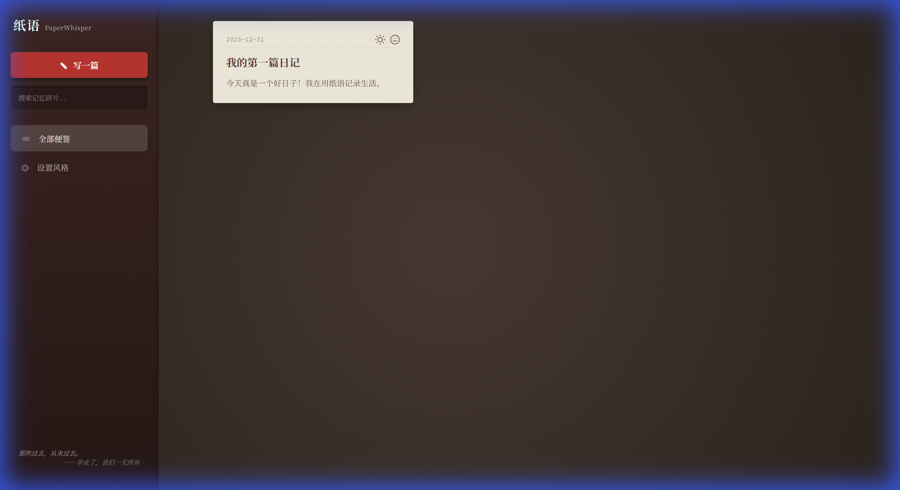
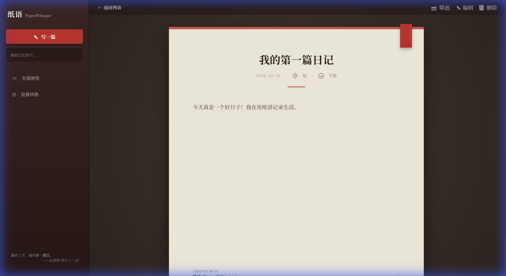
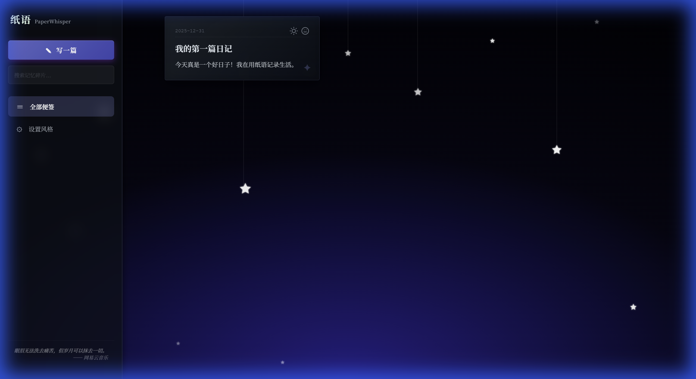

# 纸语 PaperWhisper 📖

一款优雅的桌面日记应用,专注于书写体验与视觉美学。

## ✨ 特性

### 🎨 精美主题
- **默认主题** - 经典木质纹理,温暖舒适
- **午夜星尘** - 深邃夜空,星光点点
- **海底花海** - 粉紫渐变,花瓣飘落,梦幻轻盈

### 📝 强大功能
- **Markdown支持** - 实时预览,格式自由
- **天气心情** - 记录当天天气和心情状态
- **图片导出** - 将日记导出为精美图片
- **主题持久化** - 保存您喜欢的主题设置
- **全文搜索** - 快速查找历史日记

### 🏗️ 技术特点
- 拟物化设计,毛玻璃效果
- 流畅动画,细腻交互
- 单文件打包,开箱即用
- 数据本地存储,隐私安全

## 🚀 快速开始

### 直接使用
1. 下载`app.exe`
2. 双击运行
3. 开始书写

### 从源码运行

**环境要求**:
- Python 3.12+
- Windows 10/11

**安装依赖**:
```bash
pip install flask pywebview pythonnet
```

**启动应用**:
```bash
python app.py
```

## 📦 打包

```bash
pip install pyinstaller
pyinstaller app.spec
```

打包后的可执行文件位于`dist/app.exe`

## 📁 项目结构

```
MyDiary/
├── app.py              # 主程序
├── app.spec            # PyInstaller配置
├── templates/
│   └── index.html      # 前端页面
├── static/             # 静态资源(如有)
├── diary_data/         # 日记数据目录(运行后自动创建)
├── exports/            # 导出图片目录(运行后自动创建)
└── README.md           # 项目说明
```

## 🛠️ 技术栈

- **后端**: Flask (Python)
- **前端**: HTML + CSS + JavaScript
- **桌面**: pywebview
- **打包**: PyInstaller

## 📸 应用截图

### 主界面展示

**日记列表** - 简洁优雅的卡片式布局,一目了然


**日记详情** - 拟物化纸质风格,沉浸式书写体验


### 主题效果

**午夜星尘** - 深邃夜空,繁星点点,宁静致远


**海底花海** - 粉紫梦幻,花瓣飘落,浪漫温柔


## 📄 许可证

MIT License

## 🤝 贡献

欢迎提交Issue和Pull Request!

## 📝 版本历史

查看 [VERSION.md](VERSION.md) 了解详细更新记录

---

**Made with ❤️**
