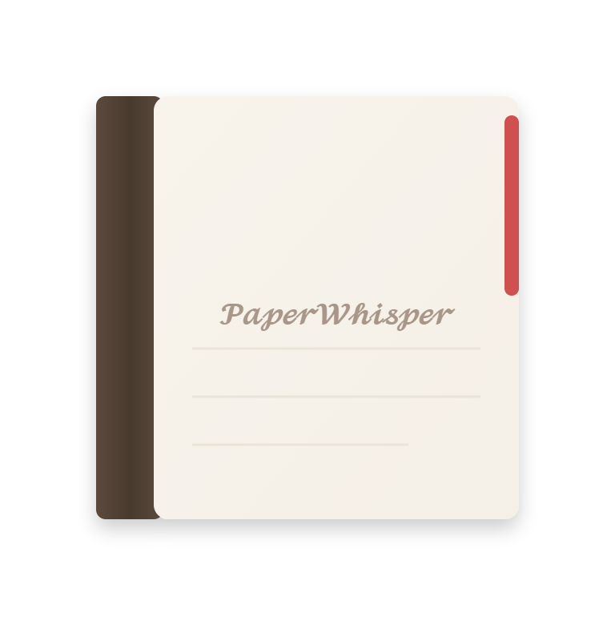

<div align="center">
  
</div>

# 纸语 PaperWhisper 📖

> 一款优雅的拟物风日记应用。

**纸语 (Paper Whisper)** 是一款基于 Flutter 重构的跨平台日记应用（支持 Windows 和 Android）。它致力于通过极致的**拟物化设计 (Skeuomorphism)**，还原真实物理世界的书写体验，让记录生活变得更加温暖和有触感。

## ✨ 核心特性

### 🎨 极致拟物
- **真实材质**: 精细打磨的木纹、纸张纹理、皮革质感，拒绝扁平化，回归真实。
- **光影交互**: 细腻的阴影、内阴影和高光处理，按钮和卡片具有真实的按压反馈。
- **流畅动画**: 包含书籍翻页、磁带转动、旋钮调节等符合物理直觉的微交互动画。

### 📝 双模记录
- **随心记 (Moments)** 📸:
  - 类似聊天界面的轻量级记录方式。
  - **磁带录音**: 独特的磁带交互 UI，支持语音录制与回放。
  - 支持图文混排，快速捕捉生活瞬间。
- **专注写作 (Diary)** 🖋️:
  - 沉浸式的长文写作体验。
  - **书籍翻页**: 逼真的 3D 翻页效果，模拟真实日记本的阅读感受。
  - 支持 Markdown 实时预览。

### ☁️ 数据同步
- **WebDAV 支持**: 内置 WebDAV 客户端，支持坚果云等第三方云服务。
- **数据自主**: 所有数据存储在本地或用户自己的云盘中，隐私完全掌握在自己手中。

### 🛠️ 更多功能
- **多主题**: 提供“海底花海”、“午夜星尘”等多种精美拟物主题。
- **隐私锁**: 支持密码保护，守护你的秘密。
- **全文搜索**: 快速检索历史日记和随心记。
- **跨平台**: 完美适配 Windows 桌面端与 Android 移动端。

## 🏗️ 技术栈

本项目使用 Flutter 进行开发，核心依赖包括：

- **UI 框架**: Flutter (Dart)
- **状态管理**: Provider
- **动画**: `simple_animations` (自定义补间动画)
- **数据存储**: `sqflite` (本地数据库), `shared_preferences`
- **网络与同步**: `webdav_client` (WebDAV 协议), `http`
- **多媒体**: `audioplayers` (音频播放), `record` (录音)
- **其他**: `flutter_markdown` (Markdown 渲染), `intl` (国际化)

## 🚀 快速开始

### 环境要求
- Flutter SDK 3.47.1（当前开发基线；锁定依赖最低要求 3.44.0）
- Dart SDK 3.13.1（随 Flutter 提供；锁定依赖最低要求 3.12.0）
- Windows 10/11 或 Android 环境

### 运行项目

1. **克隆项目**
   ```bash
   git clone https://github.com/your-repo/paperwhisper.git
   cd paperwhisper
   ```

2. **进入 Flutter 目录**
   ```bash
   cd paper_whisper_flutter
   ```

3. **安装依赖**
   ```bash
   flutter pub get
   ```

4. **运行应用**
   ```bash
   # Windows
   flutter run -d windows

   # Android (需连接设备或启动模拟器)
   flutter run -d android
   ```

### 本地构建

```bash
# 构建 Windows 安装包
flutter build windows

# 构建 Android APK
flutter build apk --release
```

### 正式发布

正式版本统一通过仓库根目录下的 PowerShell 脚本发布：

```powershell
# 只根据上一个正式版本以来的提交预览更新日志，不修改文件或访问远端
.\scripts\release.ps1 -Preview

# 审阅更新日志和版本信息，确认后发布 Windows 与 Android
.\scripts\release.ps1
```

脚本会生成可编辑的更新日志草稿，并要求输入精确确认文本后才执行版本同步、质量检查、构建、Git 提交/tag、GitHub Release 和 R2/S3 上传。完整参数、发布顺序和失败恢复方式见 [`releases/README.md`](releases/README.md)。

## 📁 目录结构 (Flutter)

```
paper_whisper_flutter/
├── lib/
│   ├── config/         # 应用配置 (主题、常量)
│   ├── models/         # 数据模型 (Diary, Moment, User)
│   ├── pages/          # 页面视图 (HomePage, DiaryPage, MomentsPage)
│   ├── providers/      # 状态管理 (ThemeProvider, SyncProvider)
│   ├── services/       # 核心服务 (DatabaseService, WebDavService)
│   ├── utils/          # 工具类
│   ├── widgets/        # 通用组件 (拟物按钮, 卡片, 输入框)
│   └── main.dart       # 入口文件
├── assets/             # 静态资源 (图片, 字体, 材质贴图)
└── pubspec.yaml        # 项目依赖配置
```

## 📄 许可证

[MIT License](LICENSE)

---
**Made with ❤️ by Lingshi**
